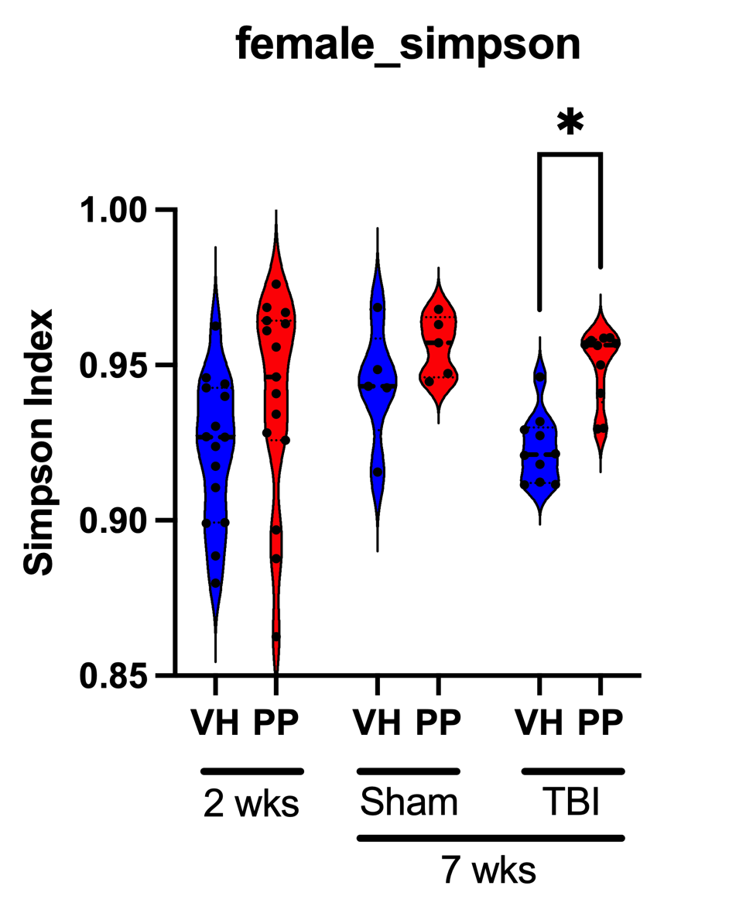
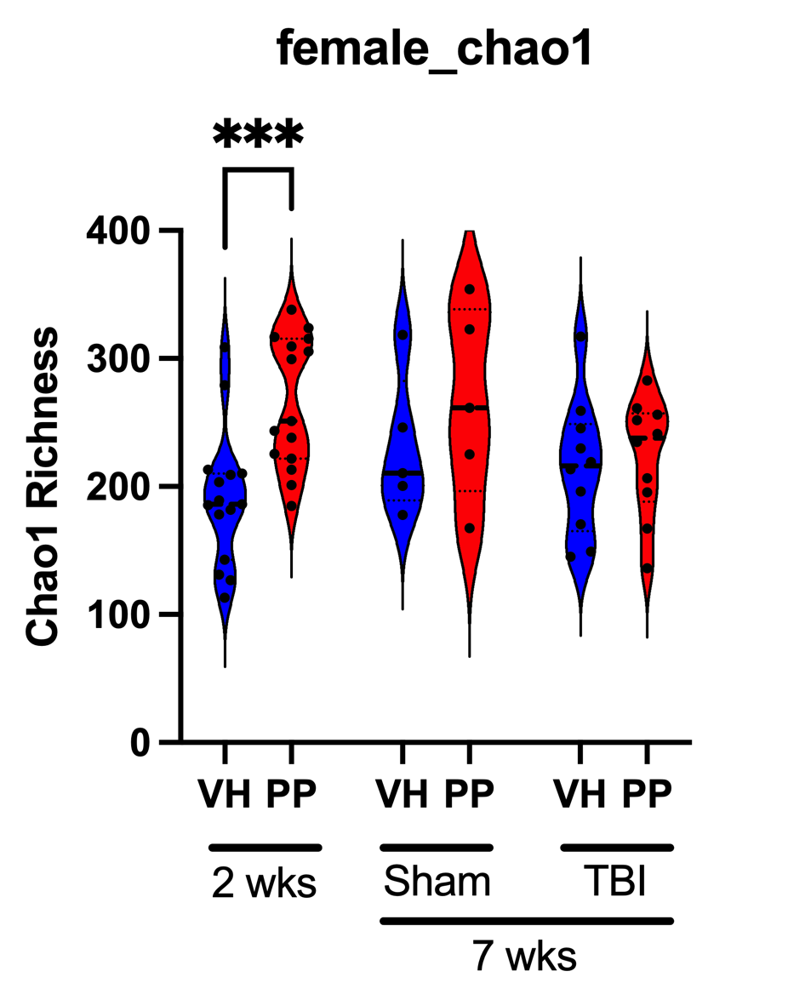
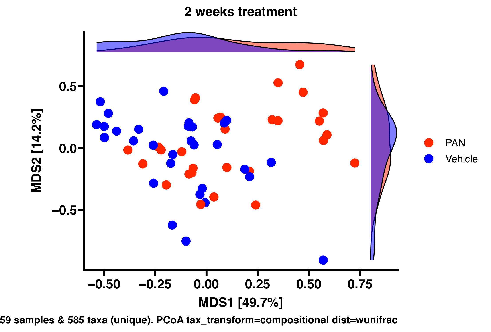
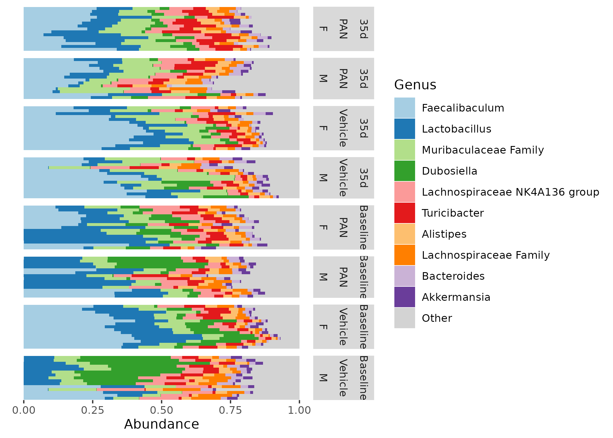
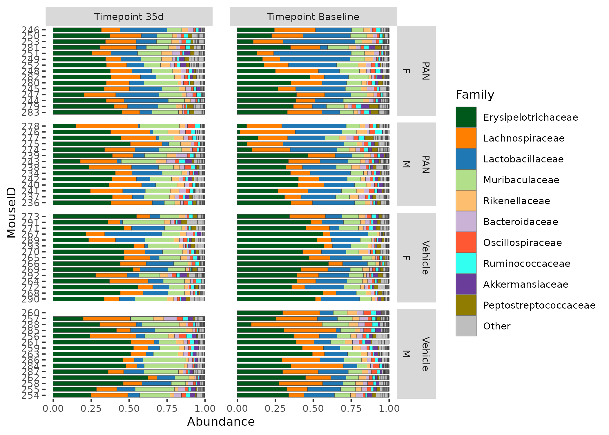
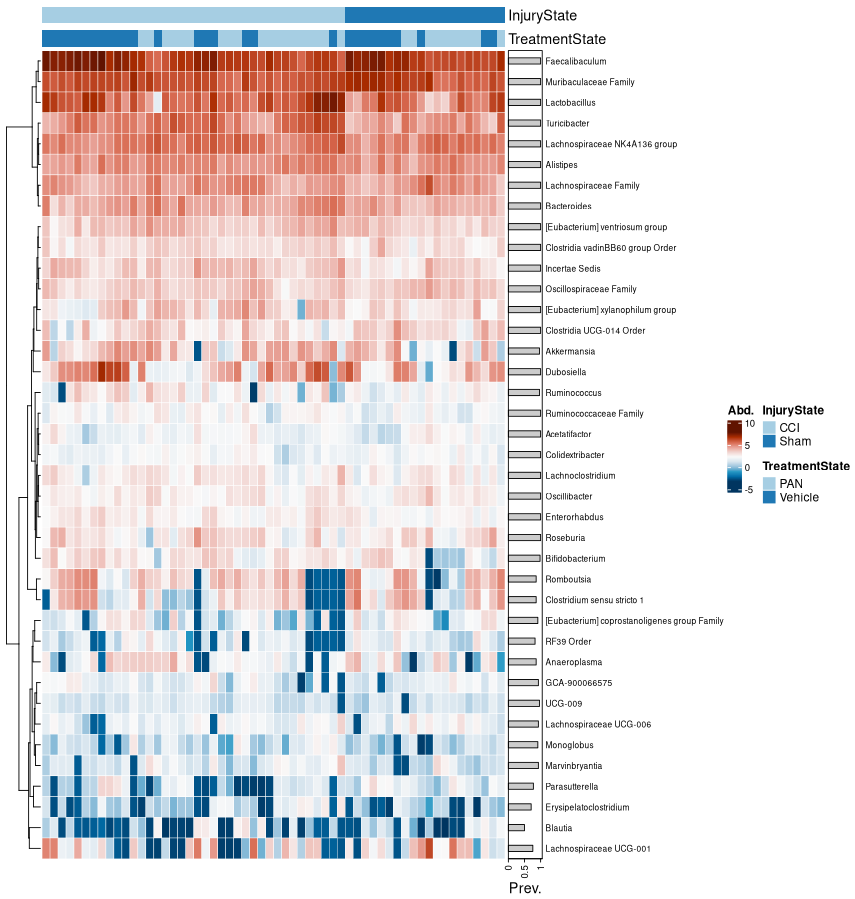
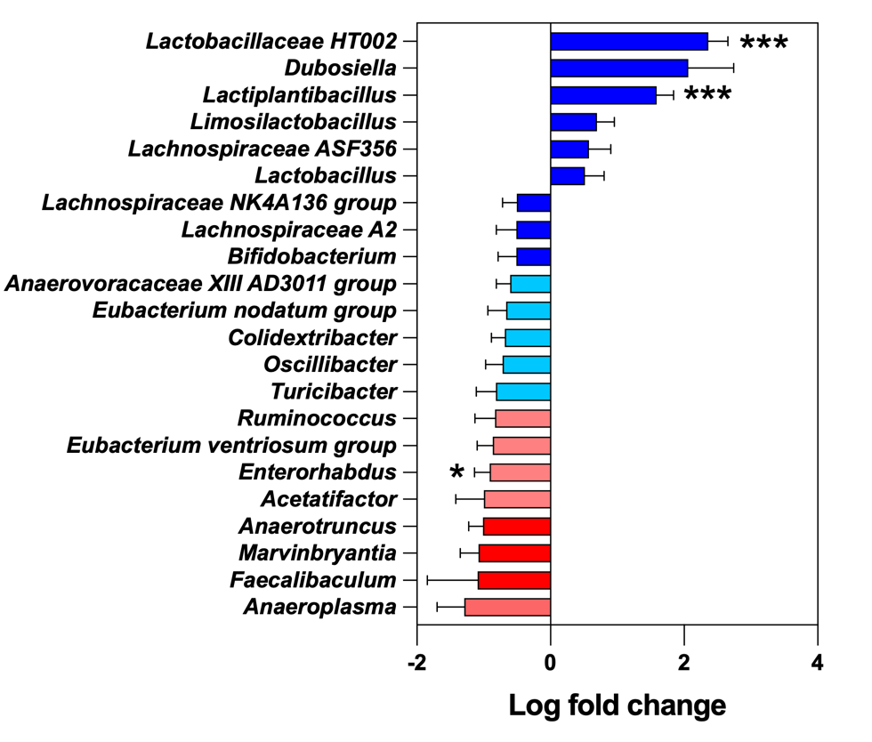
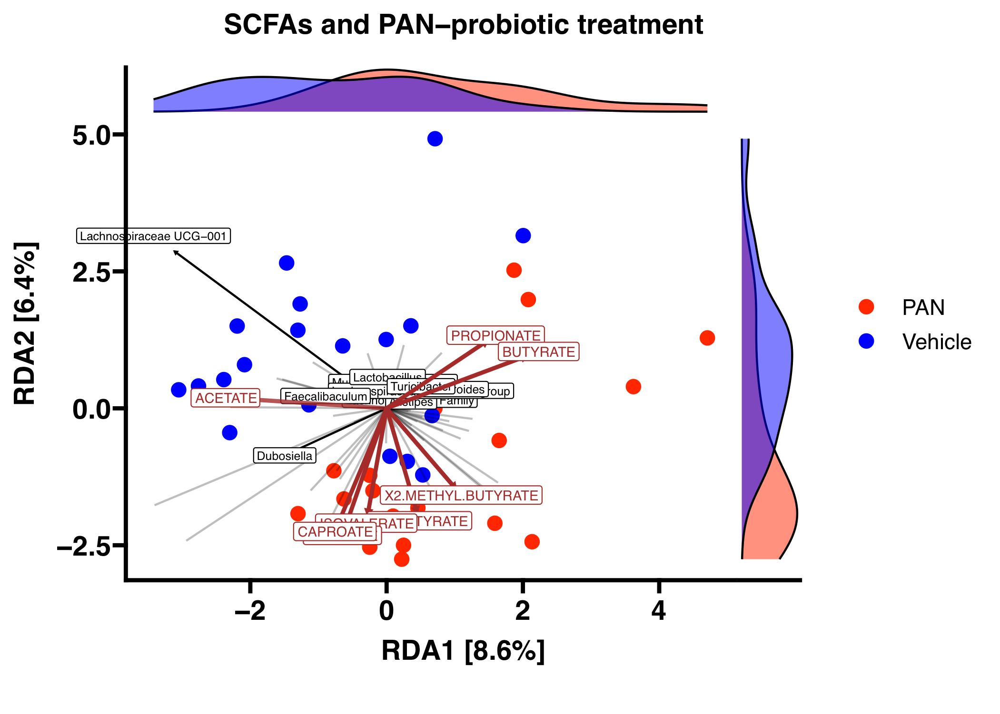
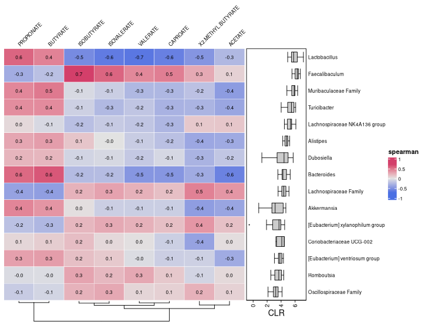

## Introduction

This vignette contains all of the code necessary for the microbiome analysis within our paper named "Probiotic treatment induces sex-specific neuroprotection after traumatic brain injury in mice". In this study, we researched the relationship between a pan-Lactobacillus probiotic, traumatic brain injury (TBI) recovery, and the gut microbiome. The gut microbiome analysis of this study was performed through short-read 16S sequencing and raw fastq data can be found at BioProject [PRJNA1095399](https://www.ncbi.nlm.nih.gov/bioproject/PRJNA1095399).

Much of the data and visualizations here had slight visual touching up in photoshop/coreldraw just to make them look _perf_ prior to submission, so if you see a difference between the figures produced here and those found within our paper that is why.

```{r setup, include=FALSE}
knitr::opts_chunk$set(echo = TRUE)
```

The raw fastq files returned from the Baylor College of Medicine sequencing core were already demultiplexed based on the single-index barcodes using the Illumina bcl2fastq software. After downloading, we took the fastq files and implemented the [nf-core ampliseq]() pipeline for reproducible and thorough microbiome processing. Once finished, we used the `dada2_physeq.rds` file from the `phyloseq` folder and the `tree.nwk` file from the `qiime2/phylogenetic_tree` folder. We used these two files for the remainder of our microbiome analysis, to which we have detailed below.

## Dependencies
```{r}

# NEW PAN ANALYSIS SCRIPT

library(phyloseq)
library(dplyr)
library(ggplot2)
library(vegan)
library(ape)
library(ggsci)
library(microViz)
library(reshape2)
library(tidyr)
library(pheatmap)
library(Hmisc)
library(tibble)
library(ggprism)
library(ggsci)

```

## Read files
```{r}
# Load data from nf-core ampliseq
raw_physeq <- readRDS("data/PAN_ampliseq/phyloseq/dada2_phyloseq.rds")

# Now we read in the phylo tree computed by qiime2
tree <- read.tree("data/PAN_ampliseq/qiime2/phylogenetic_tree/tree.nwk")

# And add it to our phyloseq object
physeq <- merge_phyloseq(raw_physeq, phy_tree(tree))

good_data <- subset_taxa(physeq, Kingdom == "Bacteria")

ps <- phyloseq_validate(good_data) %>%
  tax_fix()
```

__For all microbiome analyses__
How to pick a threshold? --> Depends on what analysis method you are filtering for!

* Alpha diversity = DO NOT FILTER
* Beta diversity = relevance of threshold depends on your distance measure
* Differential abundance testing = stringent filtering, prevalence >5%, >10%?

If you're unsure, check out the [MicroViz documentation](https://david-barnett.github.io/microViz/) or read some Amy Willis' [statdivlab](https://github.com/statdivlab) papers!

## Alpha Diversity
The following code chunks will calculate Simpson diversity and Chao1 richness for the phyloseq object and write a csv file with this information for each sample.

```{r simpson}
# Calculate Simpson
simp_data <- ps |>
  ps_calc_diversity(rank = "unique", index = "gini_simpson") %>%
  samdat_tbl()

simp_filt = simp_data |>
  select(MouseID, Treatment, Injury, Sex, Timepoint, gini_simpson_unique)

#write.csv(simp_filt, file = "pan_simpson.csv")

```

Here is an example of a plot using this data that was made in GraphPad Prism



And Chao1

```{r chao1}
# Calculate Chao1 richness
chao1_data <- ps |>
  ps_calc_richness(rank = "unique", index = "chao1") %>%
  samdat_tbl()

chao1_filt = chao1_data |>
  select(MouseID, Treatment, Injury, Sex, Timepoint, chao1_unique)

#write.csv(chao1_filt, file = "pan_chao1.csv")

```

Here is an example of a plot using this data that was made in GraphPad Prism

## Intro to beta diversity

This is useful for seeing where we want to filter our data for beta diversity (only light filtering).

```{r, eval=FALSE}
# gotta start of with read filtering
ps |>
  ps_mutate(reads = sample_sums(ps)) |> #this will get you read depth!
  samdat_tbl() |>
  ggplot(aes(x = reads)) +
  geom_freqpoly(bins = 100) +
  geom_rug(alpha = 0.5) +
  scale_x_log10(labels = scales::label_number()) +
  labs(x = "Number of classified reads", y = NULL) +
  theme_bw()

# lets find where we should filter our data
ps_Stats <- tibble(
  taxon = taxa_names(ps),
  prevalence = microbiome::prevalence(ps),
  total_abundance = taxa_sums(ps)
)

# plot 
p <- ps_Stats |>
  ggplot(aes(total_abundance, prevalence)) +
  geom_point(alpha = 0.5) +
  geom_rug(alpha = 0.1) +
  scale_x_continuous(
    labels = scales::label_number(), name = "Total Abundance"
  ) +
  scale_y_continuous(
    labels = scales::label_percent(), breaks = scales::breaks_pretty(n = 9),
    name = "Prevalence (%)",
    sec.axis = sec_axis(
      trans = ~ . * nsamples(ps), breaks = scales::breaks_pretty(n = 9),
      name = "Prevalence (N samples)"
    )
  ) +
  theme_bw()

# and add the taxa labels 
p + ggrepel::geom_text_repel(
  data = function(df) filter(df, total_abundance > 1e9 | prevalence > 0.6),
  mapping = aes(label = taxon), size = 2.5, min.segment.length = 0, force = 15)

# these params were chosen as a compromise with Amy Willis' advice (STAMPS 2024)
```

Now we have an idea on how to filter our data for beta diversity analyses, we start by subsetting for Timepoints and Injury then plot using weighted unifrac distance PCoA. We also compute the permanova values between groups which was added to the figure later using CorelDRAW.


```{r, eval=FALSE}
#View(sample_data(ps))

treatment_colors <- c("Vehicle" = "#0000FF", "PAN" = "#FF2600")

ps_ba <- subset_samples(ps, Timepoint == "Baseline")
ps_ac_m <- subset_samples(ps, Timepoint == "Baseline" & Sex == "M")
ps_ac_f <- subset_samples(ps, Timepoint == "Baseline" & Sex == "F")
ps_ch_sham_m <- subset_samples(ps, Timepoint == "35d" & Injury == "Sham" & Sex == "M")
ps_ch_sham_f <- subset_samples(ps, Timepoint == "35d" & Injury == "Sham" & Sex == "F")
ps_ch_tbi_m <- subset_samples(ps, Timepoint == "35d" & Injury == "CCI" & Sex == "M")
ps_ch_tbi_f <- subset_samples(ps, Timepoint == "35d" & Injury == "CCI" & Sex == "F")


# Generate the plot with custom colors for densities and sample points
ps_ba |>
  tax_filter(min_prevalence = 2 / 100, verbose = FALSE, min_total_abundance = 50) |>
  tax_transform(trans = "compositional", rank = "unique") |>
  dist_calc(dist = "wunifrac") |>
  ord_calc("PCoA") |>
  ord_plot(color = "Treatment", size = 4) +
  scale_color_manual(values = treatment_colors, name = "Treatment") +
  scale_fill_manual(values = treatment_colors, name = "Treatment") +
  theme_prism() +
  ggtitle("2 weeks treatment") +
  ggside::geom_xsidedensity(aes(fill = Treatment), alpha = 0.5, show.legend = FALSE) +
  ggside::geom_ysidedensity(aes(fill = Treatment), alpha = 0.5, show.legend = FALSE) +
  ggside::theme_ggside_void() +
  theme(
    axis.title.x = element_text(size = 14),
    axis.title.y = element_text(size = 14),
    axis.text.x = element_text(size = 14),
    axis.text.y = element_text(size = 14),
    plot.title = element_text(size = 14)
  )

#ggsave("/condo/neurobiome/tmhagm8/pan_redo/workdir/beta_div/7weeks_tbi_males_wuni.pdf", height = 5, width = 7, units = "in")

#recompute distance for permanova
treat_dists <- ps_ba |>
  tax_filter(min_prevalence = 2 / 100, verbose = FALSE, min_total_abundance = 50) |>
  tax_transform(trans = "compositional", rank = "unique") |>
  dist_calc("wunifrac")

# the more permutations you request, the longer it takes
# but also the more stable and precise your p-values become
treat_perm <- treat_dists |>
  dist_permanova(
    seed = 1234, # for set.seed to ensure reproducibility of random process
    n_processes = 1, n_perms = 999, # you should use at least 999!
    variables = "Treatment"
  )

# view the permanova results
treat_permdf <- perm_get(treat_perm) |> as.data.frame()
#write.table(treat_permdf, file ="/condo/neurobiome/tmhagm8/pan_redo/workdir/beta_div/2weeks_wuni_pcoa_permanova.tsv", sep = "\t")

```



## Relative abundance plots (ol' faithful)

Super useful to make your own palette and assign to certain taxa, this helps your viewers understand trends in this data. I altered this figure in coreldraw to widen it out and turn it vertically (with the facet labels).

Genus level

```{r, echo=FALSE, eval=FALSE}
# Make your custom color palette
myPal <- tax_palette(
  data = ps, rank = "Genus", n = 25, pal = "greenArmytage",
  add = c(Other = "gray")
)
tax_palette_plot(myPal)

ps |>
  comp_barplot(
    tax_level = "Genus", n_taxa = 10,
    taxa_order = sum,
    sample_order = "bray", bar_outline_colour = NA,
  ) +
  facet_grid(
    rows = vars(Timepoint, Treatment, Sex),
    scales = "free", space = "free" # these options are critically important!
  ) +
  coord_flip() +
  theme(axis.text.y = element_blank(), axis.ticks.y = element_blank())

#ggsave("/condo/neurobiome/tmhagm8/pan_redo/workdir/relabund_genus_v3_w_sex.pdf", height = 5, width = 7, units = "in")
```



And Family level (we matched the colors of the families if there wasn't a proper genus level call)

```{r, eval=FALSE}

# Make your custom color palette
myPal <- tax_palette(
  data = ps, rank = "Family", n = 25, pal = "greenArmytage",
  add = c(Other = "gray")
)
tax_palette_plot(myPal)


# Override existing values
myPal["Muribaculaceae"] <- "#B2DF8A"
myPal["Lactobacillaceae"] <- "#1F78B4"
myPal["Lachnospiraceae"] <- "#FF7F00"
myPal["Akkermansiaceae"] <- "#6A3D9A"
myPal["Bacteroidaceae"] <- "#CAB2D6"
myPal["Rikenellaceae"] <- "#FDBF6F"
myPal["Erysipelotrichaceae"] <- "#00591B"
myPal["Oscillospiraceae"] <- "#FF5833"
myPal["Ruminococcaceae"] <- "#33FFF1"
tax_palette_plot(myPal)

ps %>%
  ps_seriate(rank = "Family") %>%
  ps_mutate(MouseID = factor(MouseID, levels = unique(MouseID))) %>%
  comp_barplot(
    tax_level = "Family", n_taxa = 10, sample_order = "asis", palette = myPal,
    bar_width = 0.7, x = "MouseID", # x arg available since microViz 0.9.7
    merge_other = FALSE, bar_outline_colour = "grey25"
  ) +
  facet_grid(
    cols = vars(Timepoint), rows = vars(Treatment, Sex),
    labeller = labeller(.cols = as_labeller(~ paste("Timepoint", .))),
    scales = "free_y", # this only frees y scale per row in grid faceting
    space = "free_y" # allows bars to be same size by freeing facet heights
  ) +
  theme(text = element_text(size = 10), panel.spacing.x = unit(5, "mm")) +
  coord_flip()

#ggsave("/condo/neurobiome/tmhagm8/pan_redo/workdir/relabund_family_v9.pdf", height = 5, width = 7, units = "in")

```



## Comparing the top microbes between the treatment groups

Heatmap of abundance with treatment groups, this is a heavily filtered subset but is needed for this type of figure. I prettied this up in coreldraw just by removing the legend and changing the order of the samples. Was not used in our manuscript but still nice to have

```{r, eval = FALSE}
# I do not know why this doesnt print when ggsaving so to save the figure i run this in a separate R script and save as pdf that way.

# Assign colors for Injury states
cols_injury <- distinct_palette(n = length(unique(samdat_tbl(ps)$Injury)), add = NA)
names(cols_injury) <- unique(samdat_tbl(ps)$Injury)

# Assign colors for Treatment states
cols_treatment <- distinct_palette(n = length(unique(samdat_tbl(ps)$Treatment)), add = NA)
names(cols_treatment) <- unique(samdat_tbl(ps)$Treatment)

# Subset for the desired Timepoint
ps_ch <- subset_samples(ps, Timepoint == "35d")

# Create the heatmap with both Injury and Treatment annotations
ps_ch %>%
  # Sort samples by similarity
  ps_seriate(rank = "Genus", tax_transform = "compositional", dist = "bray") %>% 
  # Arrange samples by Injury state
  ps_arrange(Injury) %>% 
  # Apply CLR transformation
  tax_transform("clr", rank = "Genus") %>%
  # Filter taxa by prevalence and abundance
  tax_filter(min_prevalence = 0.5, verbose = FALSE, min_total_abundance = 1000) |>
  # Generate compositional heatmap
  comp_heatmap(
    tax_anno = taxAnnotation(
      Prev. = anno_tax_prev(bar_width = 0.3, size = grid::unit(1, "cm"))
    ),
    sample_anno = sampleAnnotation(
      InjuryState = anno_sample("Injury"),
      TreatmentState = anno_sample("Treatment"),
      col = list(InjuryState = cols_injury, TreatmentState = cols_treatment),
      border = FALSE
    ),
    colors = heat_palette(palette = "RdBu", rev = TRUE),
    sample_seriation = "Identity" # Keep original sample order
  )

#ggsave("/condo/neurobiome/tmhagm8/pan_redo/workdir/inj_n_treat_35d_htmp_genus.png", height = 5, width = 7, units = "in")

```



## Differential abudance analysis using ANCOMBC2

Differential abundance analysis for the three severity levels we investigated. For this analysis I wrote the outputs to a csv file and visualized them using prism but this is more than possible in R. I recommend using the ANCOMBC2 bioconductor [tutorial](https://www.bioconductor.org/packages/release/bioc/vignettes/ANCOMBC/inst/doc/ANCOMBC2.html) to do this if you so please.

```{r, eval = FALSE}
# round otu counts, we do this for our other analyses to keep consistent
round_covid = round(otu_table(ps))

# Update sample_data in phyloseq object
ps_4_daa = phyloseq(round_covid, physeq@tax_table, physeq@sam_data)

# If finding differential of treatment --> 2 weeks time point
ps_m_ba = subset_samples(ps_4_daa, Sex == "M" & Timepoint == "Baseline")
ps_f_ba = subset_samples(ps_4_daa, Sex == "F" & Timepoint == "Baseline")

# If finding differential of treatment --> 7 weeks time point
ps_m_sham_35d = subset_samples(ps_4_daa, Sex == "M" & Injury == "Sham" & Timepoint == "35d")
ps_f_sham_35d = subset_samples(ps_4_daa, Sex == "F" & Injury == "Sham" & Timepoint == "35d")
ps_m_tbi_35d = subset_samples(ps_4_daa, Sex == "M" & Injury == "CCI" & Timepoint == "35d")
ps_f_tbi_35d = subset_samples(ps_4_daa, Sex == "F" & Injury == "CCI" & Timepoint == "35d")

# If finding differential of time point 
ps_m_sham_veh = subset_samples(ps_4_daa, Sex == "M" & Injury == "Sham" & Treatment == "Vehicle")
ps_f_sham_veh = subset_samples(ps_4_daa, Sex == "F" & Injury == "Sham" & Treatment == "Vehicle")
ps_m_sham_pan = subset_samples(ps_4_daa, Sex == "M" & Injury == "Sham" & Treatment == "PAN")
ps_f_sham_pan = subset_samples(ps_4_daa, Sex == "F" & Injury == "Sham" & Treatment == "PAN")

ps_m_tbi_veh = subset_samples(ps_4_daa, Sex == "M" & Injury == "CCI" & Treatment == "Vehicle")
ps_f_tbi_veh = subset_samples(ps_4_daa, Sex == "F" & Injury == "CCI" & Treatment == "Vehicle")
ps_m_tbi_pan = subset_samples(ps_4_daa, Sex == "M" & Injury == "CCI" & Treatment == "PAN")
ps_f_tbi_pan = subset_samples(ps_4_daa, Sex == "F" & Injury == "CCI" & Treatment == "PAN")

# Quantify sex difference at baseline
ps_veh_ba = subset_samples(ps_4_daa, Timepoint == "Baseline" & Treatment == "Vehicle")
ps_pan_ba = subset_samples(ps_4_daa, Timepoint == "Baseline" & Treatment == "PAN")

# And at 7 weeks
ps_sham_veh_35d = subset_samples(ps_4_daa, Injury == "Sham" & Timepoint == "35d" & Treatment == "Vehicle")
ps_sham_pan_35d = subset_samples(ps_4_daa, Injury == "Sham" & Timepoint == "35d" & Treatment == "PAN")
ps_tbi_veh_35d = subset_samples(ps_4_daa, Injury == "CCI" & Timepoint == "35d" & Treatment == "Vehicle")
ps_tbi_pan_35d = subset_samples(ps_4_daa, Injury == "CCI" & Timepoint == "35d" & Treatment == "PAN")

# Read in phyloseq for ancombc
tse = mia::convertFromPhyloseq(ps_m_tbi_pan)

# set seed for ancombc
set.seed(123)

# run ancombc
output3 = ancombc2(data = tse, assay_name = "counts", tax_level = "Genus",
                    fix_formula = "Timepoint", rand_formula = NULL,
                    p_adj_method = "holm", pseudo_sens = TRUE,
                    prv_cut = 0.1, lib_cut = 10000, s0_perc = 0.05,
                    group = "Timepoint", struc_zero = TRUE, neg_lb = TRUE,
                    alpha = 0.05, n_cl = 2, verbose = TRUE,
                    global = TRUE, pairwise = TRUE, dunnet = TRUE, trend = TRUE,
                    iter_control = list(tol = 1e-2, max_iter = 20, 
                                        verbose = TRUE),
                    em_control = list(tol = 1e-5, max_iter = 100),
                    lme_control = lme4::lmerControl(),
                    mdfdr_control = list(fwer_ctrl_method = "holm", B = 100),
                    trend_control = list(contrast = list(matrix(c(1, 0, -1, 1),
                                                                nrow = 2, 
                                                                byrow = TRUE),
                                                         matrix(c(-1, 0, 1, -1),
                                                                nrow = 2, 
                                                                byrow = TRUE),
                                                         matrix(c(1, 0, 1, -1),
                                                                nrow = 2, 
                                                                byrow = TRUE)),
                                         node = list(2, 2, 1),
                                         solver = "ECOS",
                                         B = 100))

#Print output to dataframe
res_prim3 <- output3$res

#Save ancombc stats for each subset
#write.csv(res_prim3, file = "ps_tbi_pan_male_timecomp_ancom.csv", row.names = FALSE)
```

Here is an example of a plot using this data that was made in GraphPad Prism


## Now let's look at the connection between SCFAs and microbes

Add the SCFA normalized and transformed concentrations (performed in [Metaboanalyst](https://www.metaboanalyst.ca/)) for each mouse to the metadata, only looking at TBI group.

```{r, eval=FALSE}

# Now row.names = 1 ensures the first column becomes row names.
scfa_data <- read.csv("scfa/data_normalized.csv", header = TRUE, check.names = F)

# Rename it to MouseID:
colnames(scfa_data)[1] <- "MouseID"

# Get ps sample data df
sample_meta <- data.frame(sample_data(ps))

# Merge by MouseID
merged_meta <- sample_meta %>%
  full_join(scfa_data, by = "MouseID")

# make sure merged_meta has the same rownames.
rownames(merged_meta) <- rownames(sample_meta)

# Convert merged_meta back to a sample_data object
sample_data(ps) <- sample_data(merged_meta)

#View(sample_data(ps))

#############################
# Now we can subset to the mice we want to use in the RDA (All TBI Mice with scfa data)

ps_scfa = subset_samples(ps, Label == "TBI-VEH" & Timepoint == "35d" | Label == "TBI-PAN" & Timepoint == "35d")

#View(sample_data(ps_scfa))

```


## Redundancy analysis (RDA)

To attempt some SCFA and microbial abundance connections **(not included in manuscript)**

```{r, eval=FALSE, layout="l-body-outset", fig.width=6, fig.height=5}

# First, define your custom color palette
ps_scfa %>%
  ps_mutate(
    ACETATE = ACETATE,
    PROPIONATE = PROPIONATE,
    ISOBUTYRATE = ISOBUTYRATE,
    BUTYRATE = BUTYRATE,
    `2-METHYL-BUTYRATE` = `X2.METHYL.BUTYRATE`,
    ISOVALERATE = ISOVALERATE,
    VALERATE = VALERATE,
    CAPROATE = CAPROATE
  ) |>
  tax_transform("clr", rank = "Genus") |>
  ord_calc(
    constraints = c("ACETATE", "PROPIONATE", "ISOBUTYRATE", "BUTYRATE", "X2.METHYL.BUTYRATE", "ISOVALERATE", "VALERATE", "CAPROATE"),
    scale_cc = FALSE # doesn't make a difference
  ) |>
  ord_plot(
    colour = "Treatment", size = 3, alpha = 1,
    plot_taxa = tax_top(ps_scfa, 10, by = max, rank = "Genus")
  ) +
  scale_color_manual(
    values = c(
      "Vehicle" = "#0000FF",
      "PAN" = "#FF2600"
    ),
    name = "Treatment"
  ) +
  scale_fill_manual(
    values = c(
      "Vehicle" = "#0000FF",
      "PAN" = "#FF2600"
    ),
    name = "Treatment"
  ) +
  theme_prism() +
  # if you want to name your samples you can use this
  # geom_text_repel(aes(label = sample_names(sig_mental_microbes)), 
  #                 size = 3, 
  #                 max.overlaps = Inf,
  #                 box.padding = 0.5,
  #                 point.padding = 0.1,
  #                 segment.color = "grey50") +
  ggtitle("SCFAs and PAN-probiotic treatment") +
  ggside::geom_xsidedensity(aes(fill = Treatment), alpha = 0.5, show.legend = FALSE) +
  ggside::geom_ysidedensity(aes(fill = Treatment), alpha = 0.5, show.legend = FALSE) +
  ggside::theme_ggside_void() +
  theme(
    axis.title.x = element_text(size = 14),
    axis.title.y = element_text(size = 14),
    axis.text.x = element_text(size = 14),
    axis.text.y = element_text(size = 14),
    plot.title = element_text(size = 14)
  )

#ggsave("/condo/neurobiome/tmhagm8/pan_redo/workdir/scfa_pan_rda_genus_tbi_only.pdf", height = 5, width = 7, units = "in")

```



Let's see the correlation heatmap of the SCFA and microbial abundance comparisons **(not included in manuscript)**

```{r, eval=FALSE}
set.seed(111) # ensures making same random variables every time!

ps_scfa_veh_m <- subset_samples(ps_scfa, Injury == "CCI" & Treatment == "Vehicle" & Sex == "M")
ps_scfa_veh_f <- subset_samples(ps_scfa, Injury == "CCI" & Treatment == "Vehicle" & Sex == "F")
ps_scfa_pan_m <- subset_samples(ps_scfa, Injury == "CCI" & Treatment == "PAN" & Sex == "M")
ps_scfa_pan_f <- subset_samples(ps_scfa, Injury == "CCI" & Treatment == "PAN" & Sex == "F")

ps_scfa_m <- subset_samples(ps_scfa, Injury == "CCI" & Sex == "M")
ps_scfa_f <- subset_samples(ps_scfa, Injury == "CCI" & Sex == "F")

ps_scfa_pan_f %>%
  tax_agg("Genus") %>%
  tax_sort(by = prev, at = "Genus") %>%
  cor_heatmap(
    seriation_method = "Identity",
    seriation_method_col = "OLO_ward",
    taxa = tax_top(ps_scfa_veh, 15, by = max, rank = "Genus"),
    vars = c("ACETATE", "PROPIONATE", "ISOBUTYRATE", "BUTYRATE", "X2.METHYL.BUTYRATE", "ISOVALERATE", "VALERATE", "CAPROATE"),
    cor = "spearman",
    tax_anno = taxAnnotation(
      CLR = anno_tax_box(trans = "clr", zero_replace = "halfmin")
    )
  )

#ggsave("/condo/neurobiome/tmhagm8/pan_redo/workdir/ps_scfa_pan_f_spear.pdf", height = 5, width = 7, units = "in")

```



## Individual Lactobacillus

And to print out the trasnformed abundance of Lactobacillus and a couple species we found at the species level we can use the ugly brute force like code.
(Defintely should have been a loop)

```{r,  code_folding=TRUE, eval=FALSE}

# separate our groups to get the CLR abundance of our fav taxa
ps_m_ba_VH = subset_samples(good_data, Sex == "M" & Timepoint == "Baseline" & Treatment == "Vehicle")
ps_m_ba_PP = subset_samples(good_data, Sex == "M" & Timepoint == "Baseline" & Treatment == "PAN")
ps_f_ba_VH = subset_samples(good_data, Sex == "F" & Timepoint == "Baseline" & Treatment == "Vehicle")
ps_f_ba_PP = subset_samples(good_data, Sex == "F" & Timepoint == "Baseline" & Treatment == "PAN")


# separate our groups to get the CLR abundance of our fav taxa (7 weeks timepoint)
ps_m_35d_VH_sham = subset_samples(good_data, Sex == "F" & Timepoint == "35d" & Treatment == "Vehicle" & Injury == "Sham")
ps_m_35d_PP_sham = subset_samples(good_data, Sex == "F" & Timepoint == "35d" & Treatment == "PAN" & Injury == "Sham")
ps_f_35d_VH_sham = subset_samples(good_data, Sex == "F" & Timepoint == "35d" & Treatment == "Vehicle" & Injury == "Sham")
ps_f_35d_PP_sham = subset_samples(good_data, Sex == "F" & Timepoint == "35d" & Treatment == "PAN" & Injury == "Sham")
ps_m_35d_VH_tbi = subset_samples(good_data, Sex == "M" & Timepoint == "35d" & Treatment == "Vehicle" & Injury == "CCI")
ps_m_35d_PP_tbi = subset_samples(good_data, Sex == "M" & Timepoint == "35d" & Treatment == "PAN" & Injury == "CCI")
ps_f_35d_VH_tbi = subset_samples(good_data, Sex == "F" & Timepoint == "35d" & Treatment == "Vehicle" & Injury == "CCI")
ps_f_35d_PP_tbi = subset_samples(good_data, Sex == "F" & Timepoint == "35d" & Treatment == "PAN" & Injury == "CCI")

# lacto genus level

ps_m_ba_VH_l_genus <- ps_m_ba_VH %>%
  tax_fix(suffix_rank = "current") %>%
  tax_transform(trans = "log10p", rank = "Genus") %>%
  ps_get() %>%
  ps_otu2samdat("Lactobacillus") %>%
  samdat_tbl()

ps_m_ba_PP_l_genus <- ps_m_ba_PP %>%
  tax_fix(suffix_rank = "current") %>%
  tax_transform(trans = "log10p", rank = "Genus") %>%
  ps_get() %>%
  ps_otu2samdat("Lactobacillus") %>%
  samdat_tbl()

ps_f_ba_VH_l_genus <- ps_f_ba_VH %>%
  tax_fix(suffix_rank = "current") %>%
  tax_transform(trans = "log10p", rank = "Genus") %>%
  ps_get() %>%
  ps_otu2samdat("Lactobacillus") %>%
  samdat_tbl()

ps_f_ba_PP_l_genus <- ps_f_ba_PP %>%
  tax_fix(suffix_rank = "current") %>%
  tax_transform(trans = "log10p", rank = "Genus") %>%
  ps_get() %>%
  ps_otu2samdat("Lactobacillus") %>%
  samdat_tbl()

# gasseri species

ps_m_ba_VH_l_gasseri <- ps_m_ba_VH %>%
  tax_fix(suffix_rank = "current", unknowns = c("bacterium", "massiliensis")) %>%
  tax_transform(trans = "log10p", rank = "Species") %>%
  ps_get() %>%
  ps_otu2samdat("gasseri") %>%
  samdat_tbl()

ps_m_ba_PP_l_gasseri <- ps_m_ba_PP %>%
  tax_fix(suffix_rank = "current", unknowns = c("bacterium", "massiliensis")) %>%
  tax_transform(trans = "log10p", rank = "Species") %>%
  ps_get() %>%
  ps_otu2samdat("gasseri") %>%
  samdat_tbl()

ps_f_ba_VH_l_gasseri <- ps_f_ba_VH %>%
  tax_fix(suffix_rank = "current", unknowns = c("bacterium", "massiliensis")) %>%
  tax_transform(trans = "log10p", rank = "Species") %>%
  ps_get() %>%
  ps_otu2samdat("gasseri") %>%
  samdat_tbl()

ps_f_ba_PP_l_gasseri <- ps_f_ba_PP %>%
  tax_fix(suffix_rank = "current", unknowns = c("bacterium", "massiliensis")) %>%
  tax_transform(trans = "log10p", rank = "Species") %>%
  ps_get() %>%
  ps_otu2samdat("gasseri") %>%
  samdat_tbl()

# helveticus species

ps_m_ba_VH_l_helveticus <- ps_m_ba_VH %>%
  tax_fix(suffix_rank = "current", unknowns = c("bacterium", "massiliensis")) %>%
  tax_transform(trans = "log10p", rank = "Species") %>%
  ps_get() %>%
  ps_otu2samdat("helveticus") %>%
  samdat_tbl()

ps_m_ba_PP_l_helveticus <- ps_m_ba_PP %>%
  tax_fix(suffix_rank = "current", unknowns = c("bacterium", "massiliensis")) %>%
  tax_transform(trans = "log10p", rank = "Species") %>%
  ps_get() %>%
  ps_otu2samdat("helveticus") %>%
  samdat_tbl()

ps_f_ba_VH_l_helveticus <- ps_f_ba_VH %>%
  tax_fix(suffix_rank = "current", unknowns = c("bacterium", "massiliensis")) %>%
  tax_transform(trans = "log10p", rank = "Species") %>%
  ps_get() %>%
  ps_otu2samdat("helveticus") %>%
  samdat_tbl()

ps_f_ba_PP_l_helveticus <- ps_f_ba_PP %>%
  tax_fix(suffix_rank = "current", unknowns = c("bacterium", "massiliensis")) %>%
  tax_transform(trans = "log10p", rank = "Species") %>%
  ps_get() %>%
  ps_otu2samdat("helveticus") %>%
  samdat_tbl()

# lactobacillus genus
write.csv(ps_m_ba_VH_l_genus, file = "ps_m_ba_VH_l_genus.csv")
write.csv(ps_m_ba_PP_l_genus, file = "ps_m_ba_PP_l_genus.csv")
write.csv(ps_f_ba_VH_l_genus, file = "ps_f_ba_VH_l_genus.csv")
write.csv(ps_f_ba_PP_l_genus, file = "ps_f_ba_PP_l_genus.csv")

# gasseri species
write.csv(ps_m_ba_VH_l_gasseri, file = "ps_m_ba_VH_l_gasseri.csv")
write.csv(ps_m_ba_PP_l_gasseri, file = "ps_m_ba_PP_l_gasseri.csv")
write.csv(ps_f_ba_VH_l_gasseri, file = "ps_f_ba_VH_l_gasseri.csv")
write.csv(ps_f_ba_PP_l_gasseri, file = "ps_f_ba_PP_l_gasseri.csv")

# gasseri species
write.csv(ps_m_ba_VH_l_helveticus, file = "ps_m_ba_VH_l_helveticus.csv")
write.csv(ps_m_ba_PP_l_helveticus, file = "ps_m_ba_PP_l_helveticus.csv")
write.csv(ps_f_ba_VH_l_helveticus, file = "ps_f_ba_VH_l_helveticus.csv")
write.csv(ps_f_ba_PP_l_helveticus, file = "ps_f_ba_PP_l_helveticus.csv")

################## Now the 35d data SHAM MICE ######################

# lacto genus level

ps_m_35d_VH_sham_l_genus <- ps_m_35d_VH_sham %>%
  tax_fix(suffix_rank = "current") %>%
  tax_transform(trans = "log10p", rank = "Genus") %>%
  ps_get() %>%
  ps_otu2samdat("Lactobacillus") %>%
  samdat_tbl()

ps_m_35d_PP_sham_l_genus <- ps_m_35d_PP_sham %>%
  tax_fix(suffix_rank = "current") %>%
  tax_transform(trans = "log10p", rank = "Genus") %>%
  ps_get() %>%
  ps_otu2samdat("Lactobacillus") %>%
  samdat_tbl()

ps_f_35d_VH_sham_l_genus <- ps_f_35d_VH_sham %>%
  tax_fix(suffix_rank = "current") %>%
  tax_transform(trans = "log10p", rank = "Genus") %>%
  ps_get() %>%
  ps_otu2samdat("Lactobacillus") %>%
  samdat_tbl()

ps_f_35d_PP_sham_l_genus <- ps_f_35d_PP_sham %>%
  tax_fix(suffix_rank = "current") %>%
  tax_transform(trans = "log10p", rank = "Genus") %>%
  ps_get() %>%
  ps_otu2samdat("Lactobacillus") %>%
  samdat_tbl()

# gasseri species

ps_m_35d_VH_sham_l_gasseri <- ps_m_35d_VH_sham %>%
  tax_fix(suffix_rank = "current", unknowns = c("bacterium", "massiliensis")) %>%
  tax_transform(trans = "log10p", rank = "Species") %>%
  ps_get() %>%
  ps_otu2samdat("gasseri") %>%
  samdat_tbl()

ps_m_35d_PP_sham_l_gasseri <- ps_m_35d_PP_sham %>%
  tax_fix(suffix_rank = "current", unknowns = c("bacterium", "massiliensis")) %>%
  tax_transform(trans = "log10p", rank = "Species") %>%
  ps_get() %>%
  ps_otu2samdat("gasseri") %>%
  samdat_tbl()

ps_f_35d_VH_sham_l_gasseri <- ps_f_35d_VH_sham %>%
  tax_fix(suffix_rank = "current", unknowns = c("bacterium", "massiliensis")) %>%
  tax_transform(trans = "log10p", rank = "Species") %>%
  ps_get() %>%
  ps_otu2samdat("gasseri") %>%
  samdat_tbl()

ps_f_35d_PP_sham_l_gasseri <- ps_f_35d_PP_sham %>%
  tax_fix(suffix_rank = "current", unknowns = c("bacterium", "massiliensis")) %>%
  tax_transform(trans = "log10p", rank = "Species") %>%
  ps_get() %>%
  ps_otu2samdat("gasseri") %>%
  samdat_tbl()

# helveticus species

ps_m_35d_VH_sham_l_helveticus <- ps_m_35d_VH_sham %>%
  tax_fix(suffix_rank = "current", unknowns = c("bacterium", "massiliensis")) %>%
  tax_transform(trans = "log10p", rank = "Species") %>%
  ps_get() %>%
  ps_otu2samdat("helveticus") %>%
  samdat_tbl()

ps_m_35d_PP_sham_l_helveticus <- ps_m_35d_PP_sham %>%
  tax_fix(suffix_rank = "current", unknowns = c("bacterium", "massiliensis")) %>%
  tax_transform(trans = "log10p", rank = "Species") %>%
  ps_get() %>%
  ps_otu2samdat("helveticus") %>%
  samdat_tbl()

ps_f_35d_VH_sham_l_helveticus <- ps_f_35d_VH_sham %>%
  tax_fix(suffix_rank = "current", unknowns = c("bacterium", "massiliensis")) %>%
  tax_transform(trans = "log10p", rank = "Species") %>%
  ps_get() %>%
  ps_otu2samdat("helveticus") %>%
  samdat_tbl()

ps_f_35d_PP_sham_l_helveticus <- ps_f_35d_PP_sham %>%
  tax_fix(suffix_rank = "current", unknowns = c("bacterium", "massiliensis")) %>%
  tax_transform(trans = "log10p", rank = "Species") %>%
  ps_get() %>%
  ps_otu2samdat("helveticus") %>%
  samdat_tbl()

# lactobacillus genus
write.csv(ps_m_35d_VH_sham_l_genus, file = "ps_m_35d_VH_sham_l_genus.csv")
write.csv(ps_m_35d_PP_sham_l_genus, file = "ps_m_35d_PP_sham_l_genus.csv")
write.csv(ps_f_35d_VH_sham_l_genus, file = "ps_f_35d_VH_sham_l_genus.csv")
write.csv(ps_f_35d_PP_sham_l_genus, file = "ps_f_35d_PP_sham_l_genus.csv")

# gasseri species
write.csv(ps_m_35d_VH_sham_l_gasseri, file = "ps_m_35d_VH_sham_l_gasseri.csv")
write.csv(ps_m_35d_PP_sham_l_gasseri, file = "ps_m_35d_PP_sham_l_gasseri.csv")
write.csv(ps_f_35d_VH_sham_l_gasseri, file = "ps_f_35d_VH_sham_l_gasseri.csv")
write.csv(ps_f_35d_PP_sham_l_gasseri, file = "ps_f_35d_PP_sham_l_gasseri.csv")

# gasseri species
write.csv(ps_m_35d_VH_sham_l_helveticus, file = "ps_m_35d_VH_sham_l_helveticus.csv")
write.csv(ps_m_35d_PP_sham_l_helveticus, file = "ps_m_35d_PP_sham_l_helveticus.csv")
write.csv(ps_f_35d_VH_sham_l_helveticus, file = "ps_f_35d_VH_sham_l_helveticus.csv")
write.csv(ps_f_35d_PP_sham_l_helveticus, file = "ps_f_35d_PP_sham_l_helveticus.csv")

################## Now the 35d data TBI MICE ######################

# lacto genus level

ps_m_35d_VH_tbi_l_genus <- ps_m_35d_VH_tbi %>%
  tax_fix(suffix_rank = "current") %>%
  tax_transform(trans = "log10p", rank = "Genus") %>%
  ps_get() %>%
  ps_otu2samdat("Lactobacillus") %>%
  samdat_tbl()

ps_m_35d_PP_tbi_l_genus <- ps_m_35d_PP_tbi %>%
  tax_fix(suffix_rank = "current") %>%
  tax_transform(trans = "log10p", rank = "Genus") %>%
  ps_get() %>%
  ps_otu2samdat("Lactobacillus") %>%
  samdat_tbl()

ps_f_35d_VH_tbi_l_genus <- ps_f_35d_VH_tbi %>%
  tax_fix(suffix_rank = "current") %>%
  tax_transform(trans = "log10p", rank = "Genus") %>%
  ps_get() %>%
  ps_otu2samdat("Lactobacillus") %>%
  samdat_tbl()

ps_f_35d_PP_tbi_l_genus <- ps_f_35d_PP_tbi %>%
  tax_fix(suffix_rank = "current") %>%
  tax_transform(trans = "log10p", rank = "Genus") %>%
  ps_get() %>%
  ps_otu2samdat("Lactobacillus") %>%
  samdat_tbl()

# gasseri species

ps_m_35d_VH_tbi_l_gasseri <- ps_m_35d_VH_tbi %>%
  tax_fix(suffix_rank = "current", unknowns = c("bacterium", "massiliensis")) %>%
  tax_transform(trans = "log10p", rank = "Species") %>%
  ps_get() %>%
  ps_otu2samdat("gasseri") %>%
  samdat_tbl()

ps_m_35d_PP_tbi_l_gasseri <- ps_m_35d_PP_tbi %>%
  tax_fix(suffix_rank = "current", unknowns = c("bacterium", "massiliensis")) %>%
  tax_transform(trans = "log10p", rank = "Species") %>%
  ps_get() %>%
  ps_otu2samdat("gasseri") %>%
  samdat_tbl()

ps_f_35d_VH_tbi_l_gasseri <- ps_f_35d_VH_tbi %>%
  tax_fix(suffix_rank = "current", unknowns = c("bacterium", "massiliensis")) %>%
  tax_transform(trans = "log10p", rank = "Species") %>%
  ps_get() %>%
  ps_otu2samdat("gasseri") %>%
  samdat_tbl()

ps_f_35d_PP_tbi_l_gasseri <- ps_f_35d_PP_tbi %>%
  tax_fix(suffix_rank = "current", unknowns = c("bacterium", "massiliensis")) %>%
  tax_transform(trans = "log10p", rank = "Species") %>%
  ps_get() %>%
  ps_otu2samdat("gasseri") %>%
  samdat_tbl()

# helveticus species

ps_m_35d_VH_tbi_l_helveticus <- ps_m_35d_VH_tbi %>%
  tax_fix(suffix_rank = "current", unknowns = c("bacterium", "massiliensis")) %>%
  tax_transform(trans = "log10p", rank = "Species") %>%
  ps_get() %>%
  ps_otu2samdat("helveticus") %>%
  samdat_tbl()

ps_m_35d_PP_tbi_l_helveticus <- ps_m_35d_PP_tbi %>%
  tax_fix(suffix_rank = "current", unknowns = c("bacterium", "massiliensis")) %>%
  tax_transform(trans = "log10p", rank = "Species") %>%
  ps_get() %>%
  ps_otu2samdat("helveticus") %>%
  samdat_tbl()

ps_f_35d_VH_tbi_l_helveticus <- ps_f_35d_VH_tbi %>%
  tax_fix(suffix_rank = "current", unknowns = c("bacterium", "massiliensis")) %>%
  tax_transform(trans = "log10p", rank = "Species") %>%
  ps_get() %>%
  ps_otu2samdat("helveticus") %>%
  samdat_tbl()

ps_f_35d_PP_tbi_l_helveticus <- ps_f_35d_PP_tbi %>%
  tax_fix(suffix_rank = "current", unknowns = c("bacterium", "massiliensis")) %>%
  tax_transform(trans = "log10p", rank = "Species") %>%
  ps_get() %>%
  ps_otu2samdat("helveticus") %>%
  samdat_tbl()

# lactobacillus genus
write.csv(ps_m_35d_VH_tbi_l_genus, file = "ps_m_35d_VH_tbi_l_genus.csv")
write.csv(ps_m_35d_PP_tbi_l_genus, file = "ps_m_35d_PP_tbi_l_genus.csv")
write.csv(ps_f_35d_VH_tbi_l_genus, file = "ps_f_35d_VH_tbi_l_genus.csv")
write.csv(ps_f_35d_PP_tbi_l_genus, file = "ps_f_35d_PP_tbi_l_genus.csv")

# gasseri species
write.csv(ps_m_35d_VH_tbi_l_gasseri, file = "ps_m_35d_VH_tbi_l_gasseri.csv")
write.csv(ps_m_35d_PP_tbi_l_gasseri, file = "ps_m_35d_PP_tbi_l_gasseri.csv")
write.csv(ps_f_35d_VH_tbi_l_gasseri, file = "ps_f_35d_VH_tbi_l_gasseri.csv")
write.csv(ps_f_35d_PP_tbi_l_gasseri, file = "ps_f_35d_PP_tbi_l_gasseri.csv")

# gasseri species
write.csv(ps_m_35d_VH_tbi_l_helveticus, file = "ps_m_35d_VH_tbi_l_helveticus.csv")
write.csv(ps_m_35d_PP_tbi_l_helveticus, file = "ps_m_35d_PP_tbi_l_helveticus.csv")
write.csv(ps_f_35d_VH_tbi_l_helveticus, file = "ps_f_35d_VH_tbi_l_helveticus.csv")
write.csv(ps_f_35d_PP_tbi_l_helveticus, file = "ps_f_35d_PP_tbi_l_helveticus.csv")
```

## Export OTU table for Firmicutues / Bacteroides ratio

To export raw counts for each sample and each ASV we can run this code and create an OTU-like csv file. We can transform these counts prior to exporting or do it outside of R, I believe we did this in prism or excel. This specific script will export a csv with the ASV identifier column, taxonomic classification, then the counts for each ASV in each sample; specifically for the Vehicle group samples.

```{r, eval = FALSE}
ps_veh = subset_samples(ps, Treatment == "Vehicle")

# Aggregate at species level
ps_species = tax_glom(ps_veh, taxrank = "Species")

# Extract the species-level OTU table as a data frame
otu_df_species = as.data.frame(otu_table(ps_species))

# Extract the taxonomy table as a data frame
tax_df = as.data.frame(tax_table(ps_species))

# Check that "Genus" and "Species" columns exist
if(!"Genus" %in% colnames(tax_df) || !"Species" %in% colnames(tax_df)) {
  stop("No 'Genus' or 'Species' column found in the taxonomy table.")
}

# Create a new combined taxon name column, e.g., "Genus species"
tax_df$Taxon = paste(tax_df$Genus, tax_df$Species, sep = " ")

# Add this new Taxon column to the OTU counts data frame
otu_df_species$Taxon = tax_df$Taxon

# Move the 'Taxon' column to the front
otu_df_species = otu_df_species[, c("Taxon", setdiff(colnames(otu_df_species), "Taxon"))]

# Write to CSV without row names, so the first column is Taxon (Genus Species)
#write.csv(otu_df_species, "pan_veh_species_counts.csv", quote = FALSE)

```

